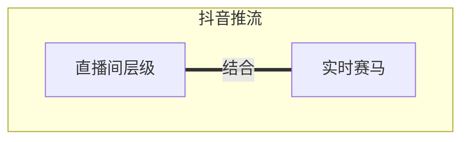

# 第二课、抖音如何推流

> 抖音推流是基于你的直播间层级和当前的实时赛马来推流
> 
{style="note"}

### 推流示例图

```mermaid
graph LR
    subgraph A[抖音推流]
    direction LR
    A1[直播间层级]===|结合|A2[实时赛马]
    end
```

直播间层级对于流量的影响更大，但是前期直播间层级未有明显

### 直播间层级

> 重要提示：
> 1. 抖音个人号可以在抖音客户端，搜索“抖音灵机”查看个人直播数据 
> 2. 抖音企业号及企业员工号可以在企业号后台查看直播大屏数据

