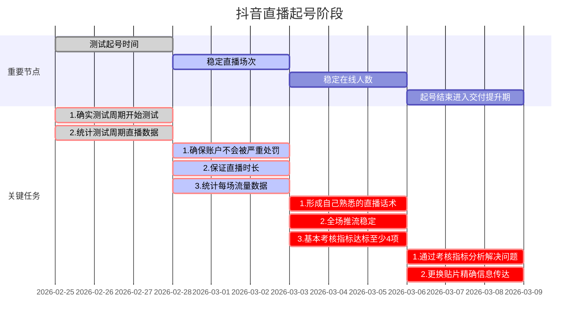

# 第四课、抖音新账号起号

> 直播带岗赋能课程专为刚进入带岗直播领域的新人设计，致力于让每一个刚进入直播带岗领域的新人都能在极短的时间内成为一名专业的直播带岗主播

## 1、什么是起号

直播起号，新账户在刚开播的一段时间内会经历一些流量低迷期，起号就是为了加速账户成型快速度过低迷期而进行的一系列操作。

## 2、起号阶段划分

## 3、起号时间选择

### 3.1 起号直播时间测试

**起号直播时间测试要点：**

1. 尽量选择多个时间段测试，最好覆盖全天
2. 单次测试时长固定，方便比对最佳起号时间段
3. 尽量错开整点开播

**建议测试起号时间节点**

| **时间段**  | **优点**                                                     | **缺点**                                           |
| ----------- | ------------------------------------------------------------ | -------------------------------------------------- |
| **6点-8点** | 该时间段相比其他时间段竞争小，流量分配较多，适合提升层级     | 不容易坚持，流量较多但容易出现不精准流量（看热闹） |
| **9点**     | 早上建议直播测试时间节点，无明显优势劣势，根据账户不同会有流量差异 |                                                    |
| **10点**    |                                                              |                                                    |
| **11点**    |                                                              |                                                    |
| **14点**    | 下午建议直播测试时间节点，无明显优势劣势，根据账户不同会有流量差异 |                                                    |
| **15点**    |                                                              |                                                    |
| **16点**    |                                                              |                                                    |
| **17点**    |                                                              |                                                    |
| **18点**    |                                                              |                                                    |
| **19-23点** | 该时间段也可以进行测试，但不同账户表现差别较大               |                                                    |
| **0-6点**   | 该时间段相比其他时间段竞争小，流量分配较多，适合提升层级     | 难坚持，流量较多但容易出现不精准流量（看热闹）     |

## 4、起号注意事项

1. 起号期间尽量不要出现违规，断流会影响起号节奏
2. 起号期间需要琢磨自己的直播话术和最适合自己的直播节奏
3. 起号测试期间尽量少换贴片，会影响测试结果